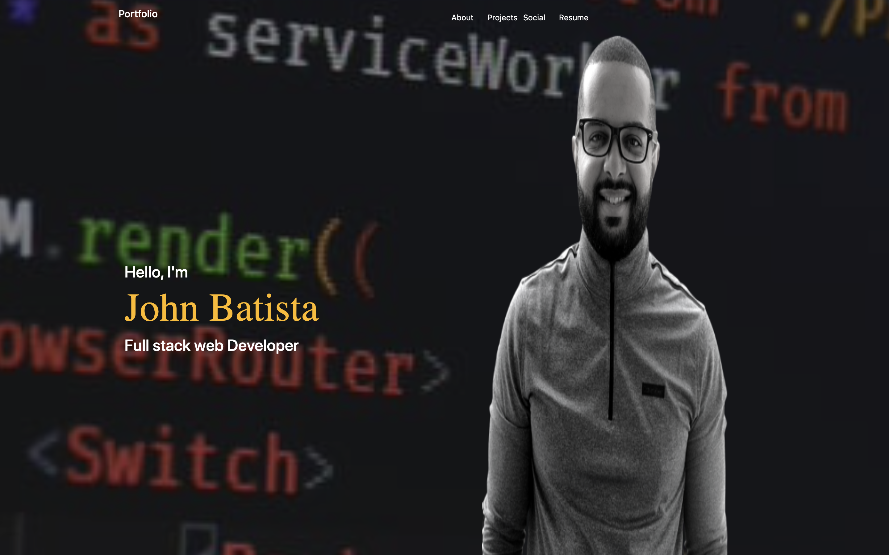

# react-updated-portfolio

## Description
This is a React update on  my portfolio page here i used 3 differnt components to recreate the page you can see all of my links and all of repos theres also i picture of myself and a brief description

## Installation
 you can clone code from repository in github link and bring it down to your local drive. From in terminal you do npm install which installs all dependences . then to start the app you do npm run start and the react app will bring you to your browser
## Usage
 clone the repo from https://github.com/johnbatista1223/react-updated-portfolio you can use visual studio code as ide then open in google chrome or any browser. The usage is to create a responsive great looking website for employers can hire me with my first job .
 

## License
MIT License

Copyright (c) [2021] [john batista]

Permission is hereby granted, free of charge, to any person obtaining a copy
of this software and associated documentation files (the "Software"), to deal
in the Software without restriction, including without limitation the rights
to use, copy, modify, merge, publish, distribute, sublicense, and/or sell
copies of the Software, and to permit persons to whom the Software is
furnished to do so, subject to the following conditions:

The above copyright notice and this permission notice shall be included in all
copies or substantial portions of the Software.

THE SOFTWARE IS PROVIDED "AS IS", WITHOUT WARRANTY OF ANY KIND, EXPRESS OR
IMPLIED, INCLUDING BUT NOT LIMITED TO THE WARRANTIES OF MERCHANTABILITY,
FITNESS FOR A PARTICULAR PURPOSE AND NONINFRINGEMENT. IN NO EVENT SHALL THE
AUTHORS OR COPYRIGHT HOLDERS BE LIABLE FOR ANY CLAIM, DAMAGES OR OTHER
LIABILITY, WHETHER IN AN ACTION OF CONTRACT, TORT OR OTHERWISE, ARISING FROM,
OUT OF OR IN CONNECTION WITH THE SOFTWARE OR THE USE OR OTHER DEALINGS IN THE
SOFTWARE.